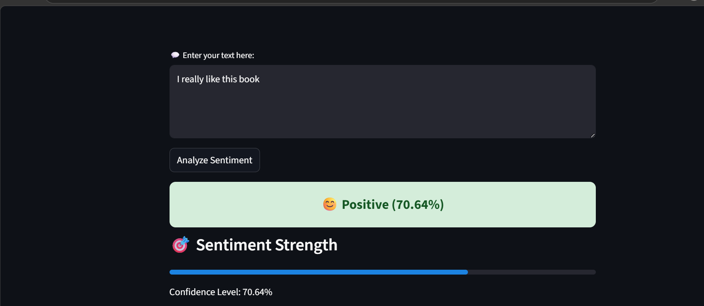
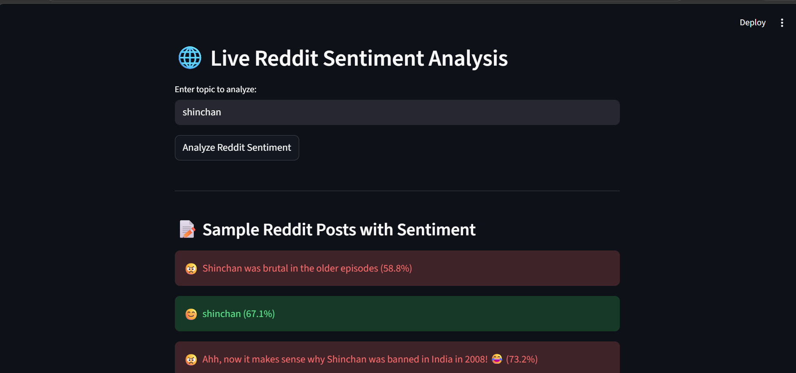
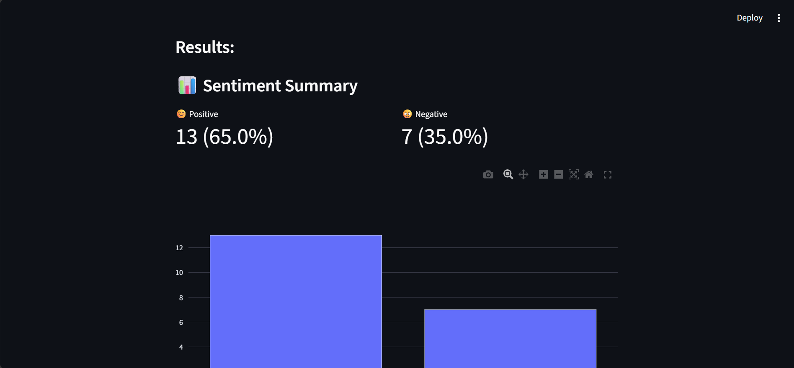
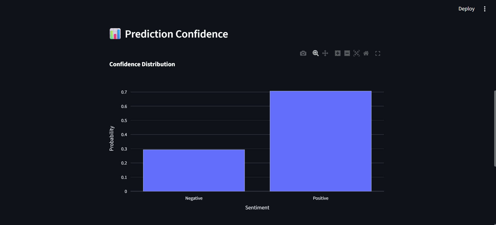
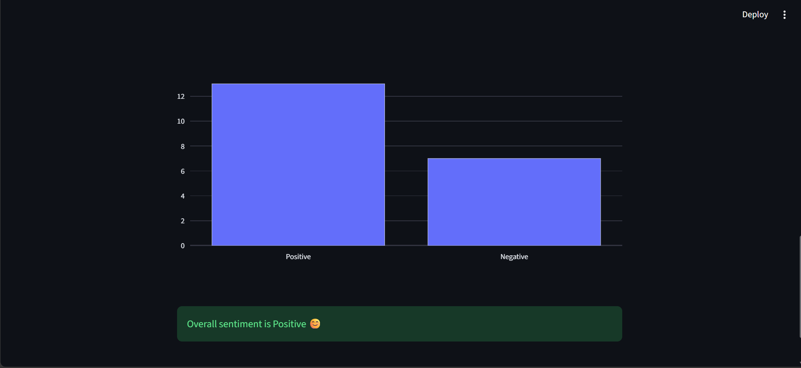

## 📊 Sentiment Analysis Dashboard

A web-based interactive dashboard that performs sentiment analysis on user input and real-time Reddit data, providing insights through visualizations and confidence scores.

## 🌍 Live Demo
https://sentiment-analysis-dashboard-drkfxaa2wh8gqmh3w8wha2.streamlit.app/

## 🚀 Features

1. 🧠 Text Sentiment Analysis
i. Enter custom text and get sentiment (Positive/Negative)
ii. Displays confidence score and emoji-based sentiment meter

2. 🌐 Live Reddit Sentiment Analysis
i. Fetches real-time Reddit posts based on a topic
ii. Analyzes sentiment of multiple posts
iii. Displays:
a. Sentiment distribution (Positive vs Negative)
b. Percentage breakdown
c. Individual post-level sentiment

3. 📊 Interactive Visualizations
i. Bar charts using Plotly
ii. Metrics and progress indicators

4. ⚡ Optimized Performance
i. Uses caching/session handling to avoid redundant API calls
ii. Smooth UI with loading indicators

## 🛠️ Tech Stack

1. Frontend/UI: Streamlit
2. Machine Learning: Scikit-learn (Logistic Regression)
3. NLP: TF-IDF Vectorization
4. Data Source: Reddit JSON API
5. Visualization: Plotly
6. Backend: Python
   
## 🧠 Model Details

1. Dataset: Twitter Sentiment Dataset (~1.6M tweets)
2. Preprocessing:
Lowercasing
Removing special characters
Stopword handling
Feature Extraction:
TF-IDF Vectorizer
3. Model:
Logistic Regression
4. Accuracy:
~78–80%

## 📸 Screenshots

### 🧠 Text Sentiment Analysis

### 🌐 Reddit Sentiment Analysis
 

### 📊 Visualization

## ▶️ How to Run Locally
1. Clone the repository
git clone https://github.com/your-username/sentiment-dashboard.git

 2.Navigate to project folder
cd sentiment-dashboard

3. Install dependencies
pip install -r requirements.txt

4. Run the app
streamlit run app.py

## 📌 Future Improvements

1. Multi-class sentiment (Positive / Neutral / Negative)
2. Emotion detection (Happy, Angry, Sad, etc.)
3. Integration with Twitter/X API
4. Time-based sentiment trends

## 💡 Project Highlights

1. End-to-end ML pipeline (data → model → deployment)
2. Real-time data integration
3. Interactive dashboard for better interpretability
4. Practical application of NLP in social media analysis
Text sentiment prediction
Reddit sentiment dashboard
Charts and post analysis
